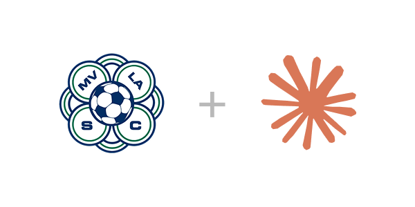

  

# MVLA Scheduling Assistant

A Claude-powered scheduling tool for MVLA team managers.

## Why Use This Tool?

If you've ever had to schedule games for an MVLA team, you know it can be a logistical nightmare: checking field availability on Byga, messaging teams on GotSport, coordinating with your coach's other teams, and avoiding conflicts with your personal calendar. And just when the schedule is all set... you get a request to reschedule a game.

This tool aims to simplify that process by giving you a conversational assistant that can access all the data you need and help you find the best options in seconds.

## Get Started

To get started, go to https://mvla.ericgio.com/ and follow the instructions.

## How does it work?

The tool is a [Claude.ai Project](https://claude.ai) — a persistent chat context that gives Claude access to your team's season info and a set of tools for fetching live data. When you ask it to schedule a game, it can:

1. Fetch available field slots from Byga
2. Fetch your team's schedule and your coach's schedule
3. Cross-references your personal calendar for conflicts
4. Suggests 2–3 ranked options with reasoning

No code to run. No spreadsheets. Just a conversation.

## What do I need?

- A [paid Claude](https://claude.com/pricing) account (free tier will not work)
- [Claude Desktop](https://claude.com/download) installed
- [Google Chrome](https://www.google.com/chrome/) with the [Claude in Chrome](https://chromewebstore.google.com/detail/claude/fcoeoabgfenejglbffodgkkbkcdhcgfn) extension installed

## Usage

Start a new chat inside your project and ask naturally:

> "Can you check field availability for the weekend of June 14–15?"

> "Schedule a home game against FC Ballistic — they can't do Saturdays."

> "What does our schedule look like for the rest of the season?"

Claude will fetch live data, flag any conflicts, and walk you through the options. On confirmation, it will draft a message to the away team manager ready to paste into GotSport.

## Current limitations

- **Field availability requires Claude in Chrome** — Claude opens a live browser tab to read Byga's field calendar. This is a temporary workaround until official Byga API access is granted.
- **One season at a time** — the season context doc is specific to a single team and season. Start a new doc each season.

## Feedback and contributions

This is a v0 built for a specific use case. If you're an MVLA manager using this and run into issues or have suggestions, please open a GitHub issue or reach out to me directly.
